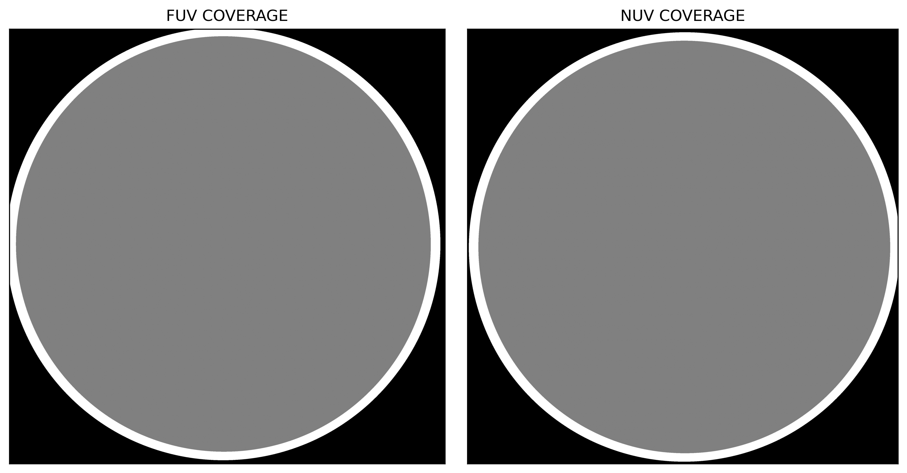

# Image Files

All image files produced by gPhoton2 will have FITS HDU headers for a [count image](#count_images) or movie (labeled "COUNT"), a [flag backplane map](#flag_maps) ("FLAG"), and a [coverage backplane map](#coverage_maps) ("COVERAGE"). The arrays in the count, flag, and coverage HDUs will be aligned; they will have identical WCS information. Any image files with only one _frame_ (as opposed to "movie" files with multiple frames) will also have an HDU containing a [dose map](#dose_maps) ("DOSE"), useful for diagnostic purposes, that is in detector coordinates and not aligned with the arrays in the other HDUs.

A description of the filenaming conventions for GALEX image files can be found in the [filename convention reference](#image_filenames).

The images that gPhoton2 produces are not immediately science-ready for most applications. This design choice maximizes the utility of gPhoton2 outputs without exploding complexity. Therefore, while few scientific measurements of use can be derived _directly from_ gPhoton2 images, almost all scientific measurements that one might desire to do can be accomplished by starting with the images and performing 1-3 additional steps. **[PROCESSING FOR COMMON TASKS WILL BE DESCRIBED ELSEWHERE]**

A description of the image HDU headers can be found [here](tables/image_metadata.md).

(count_images)=
## Count Images
The count images record the cumulative photon events corresponding to each 1.5"x1.5" pixel in sky-projected, coordinates corrected for response. They have not been scaled for effective exposure time, and no artifact or edge masking has been applied. 


*Figure: Example of count images in each band. Note the prominence of distortion around the edges of the frames. The radial streaks are internal reflections due to sources just outside of the field of view. The "donut" shapes are unmasked hotspots.*

### Movies


*Figure: 120-second movies*

(flag_maps)=
## Flag Maps

Flag maps are sky-projected bitmaps where any flagged photon in a bin sets the flag for the entire bin. The flags have the following meanings:  
- **Flag 1:** Mission hotspot mask  
- **Flag 2:** Post-CSP ghost flag  
- **Flag 4:** Wide edge flag  
- **Flag 8:** Narrow edge flag  

The flags are defined as a binary bitmask, so they are additive when more than one flag is set in the same pixel. For example, a flag value of 3 indicates that both the mission hotspot mask and post-CSP ghost flag are set.

**[DEFINE THE FLAGS HERE or link to a definition of them]**

The flag map will always have exactly the same dimensions as the count image. Therefore, if this is a `-movie` file, then the flag map will have the same number of "frames" as the image. This can be useful for excluding a subset of the the overall observation from analyses due to flagging of the target of interest (while admitting other frames).


*Figure: Example of a flag map.*

(coverage_maps)=
## Coverage

The coverage map 

The region of full depth observation is the region in which it makes sense to naively divide the count image by the observation exposure time. It would be extremely difficult and maybe impossible to accurately correct for the exposure times in these regions of fractional observation depth. Due to the leg-splitting heuristic that gPhoton uses to determine contiguous observations from the aspect data directly **[DESCRIBE THIS SOMEWHERE]**, the region of marginal exposure should never be more than a few arcminutes across. The "hard edge" flag should always describe a usable region of observation that is smaller than the region of 100% exposure depth.

Aspect-derived maps are presented in sky-projected space. The coverage is not uniform across the observation due to dither. A value of 1 indicates full coverage during the observation, while a value of 2 indicates partial coverage. A value of 0 marks areas entirely outside the observation. Typically, most researchers will be interested in areas with a coverage value of 1 (full coverage).


*Figure: Example of a coverage map.*

## Integrated Images

(dose_maps)=
## Dose Maps
The dose maps record the integrated accumulation of counts on the detector over time, in the coordinates of the detector. Because they are in detector-coordinates, the images have not been de-dithered. Therefore, point sources that are static on the sky (like stars) will trace out the inverse path of the dither in the dose map; in general, this will make them look like annuli (or donuts). Point sources that are static in the detector frame (like hotspots) will appear as point sources in the dose maps.

The primary use case for dose maps is as a detector diagnostic and calibration tool. The dose maps only appear as backplanes in `-image` files. Dose maps are the basis from which hotspot / coldspot masks are produced. They _could_ be used as a starting point for generating detector flats (_[ALTHOUGH I DON'T THINK THAT THEY WERE?]_) They can also be used to investigate detector artifacts and anomalies, as we have done here. **[LINK to artifact analysis]** It is possible to use gPhoton2 to generate movie-like or time-series dose maps with sub-visit frame depths. However, the primary use case for this (as far as we can guess) would be as part of an attempt to revisit the boresight aspect correction **[LINK to documentation]**.[^aspect_correction_note]

[^aspect_correction_note]: We put a lot of effort into refining the boresight aspect correction. **[LINK TO THAT DISCUSSION]**

Note that dose maps will not be aligned with the orientation of the sky-projected [count maps](#count_maps) for the same observation, because observations were collected at a variety of _roll angles_. It can sometimes be useful to roughly align the dose map and sky-projected images for diagnostic purposes. Doing so will require a _flip_ of the image across one axis as well as a _rotation_ (corresponding to the roll). It is often possible---for people with good spatial reasoning---to do this by eye, especially if there is an asterism or two that you can use as a guide. You can also do it in software by applying a flip and then the roll. Even then, note that the images will not _perfectly_ correlate, because there is scaling and map projection required to produce a dose map.[^dose_map]

[^dose_map]: Another way to put this---which may or may not clear up confusion---is that does maps are _not_ intermediate products on the path to sky-projected count image. There is no set of operations that turns a dose map into a count image.

```{aside}
The NUV and FUV dose maps produced by _gPhoton2_ will be aligned with each other. Somewhat annoyingly, however, the detectors were not installed on the spacecraft in the same orientation. So the "x-direction" as reported by the detector electronics (e.g. in the [photonlist files](#photonlist_filenames)) do not match across bands. Our understanding---which we communicate merely as an amusing factoid---is that this was not discovered until the spacecraft was already on orbit and the ground data processing pipeline started spitting out incorrectly aligned images.
```


*Figure: Example of a dose map image.*