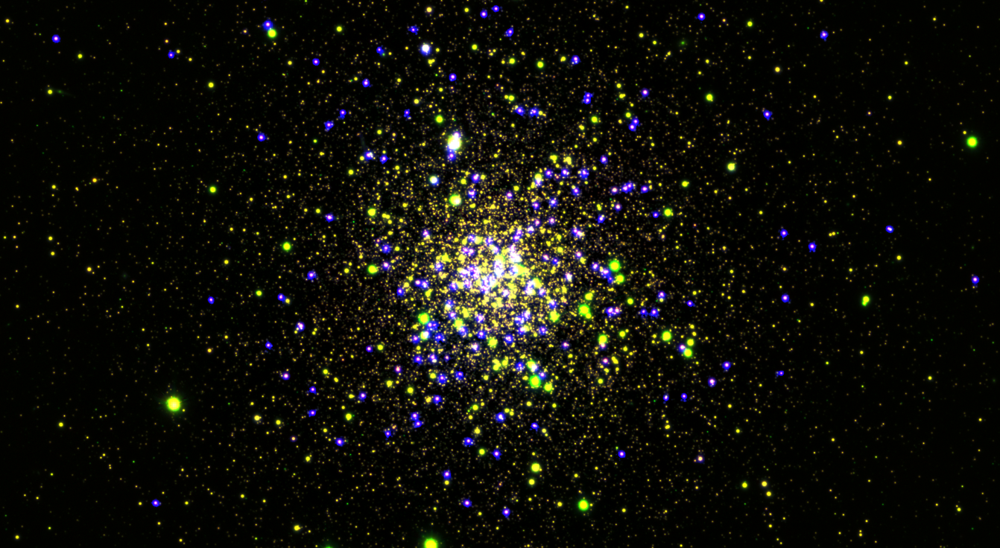

+++ { "kind": "split-image" }

## Documentation

for GALEX, gPhoton2, & the GALEX Legacy Catalog (GLCAT)

**!!!WARNING!!!**

**THIS IS A WORK IN PROGRESS!**

**Any of this may change or be wrong!**

<!-- {button}`Documentation <https://mystmd.org/guide/website-landing-pages>` -->